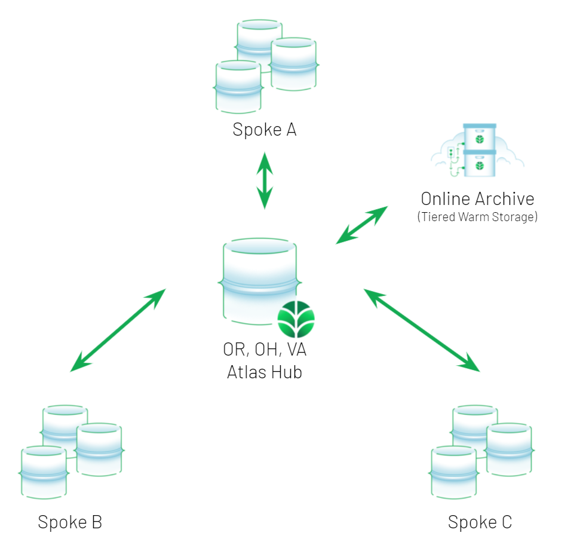

# Background
_This is a reference implementation (not suitable for production code)_

In this scenario, we want to build a Hub-and-Spoke architecture such that we can have many edge zones (Spokes) to have local reads and writes, but a subset of data will be sync'd back to a central Hub then other edge zones (Spokes) can pull down from the central Hub a subset of data it cares about.

Imagine a scenario where you want to log autonomous vehicle data with low latency. You would write the data to a MongoDB replica set in one edge zone (e.g. DFW) and it should sync to surrounding edge zones (e.g. Houston) but not distant edge zones (e.g. Boston).

In this reference implementation not meant for production, we will sync data will relevant `_pk` keys in the `messages.messages` namespace to the central Hub. Other edge zones (Spokes) will pull from the hub to the same name space based on values passed into its Docker container. The two values are:
* `ZONENAME` - a single value unique to each edge Spoke to identify it
* `WATCHZONES` - a comma delimited string of which other Spoke's `ZONENAME`s it should pull from the Hub
* `CONSTREDGE` - a MongoDB connection string for the Spoke
* `CONSTRFAR` - a MongoDB connection string for the Hub

# Example Architecture



# How To

## Prerequisites
* Have a MongoDB Replica Set running in each Spoke data center or region (we recommend managing automation and metrics with MongoDB Cloud Manager)
* Have a MongoDB Replica Set running in the central Hub data center or region (we recommend MongoDB Atlas)
* Have a server to run the Docker sync container
* Follow steps below for Docker sync container

## Enabling Hub-and-Spoke sync

1. Download the 3 files in this directory: `build.sh`, `Dockerfile`, and `edgeFarBiDi.py` onto the machine you want to run the container
2. Make sure docker is installed on that machine
3. Make sure it has internet access to pull the base layer and use `apt` and `pip` during the build
4. Edit the `-e` environmental variables in the `build.sh` to change the connection string and zones. Note that `WATCHZONES` is a comma delimited string. As always if the password has special characters, it must be URL encoded/escaped
5. Run `./build.sh` or `sudo ./build.sh` (if user does not have docker permissions)
6. The image will build and automatically start
7. Check the docker logs of the running container to make sure it says that it is READY and that there were no authentication errors or anything else. The first time running, it will build some metadata collections.
   ```
   Ready...

   Ready Far

   Ready Edge
   ```
8. Anything inserted into the `messages.messages` collection will be sync'd according to the partition rules defined as `ZONENAME` and `WATCHZONES`